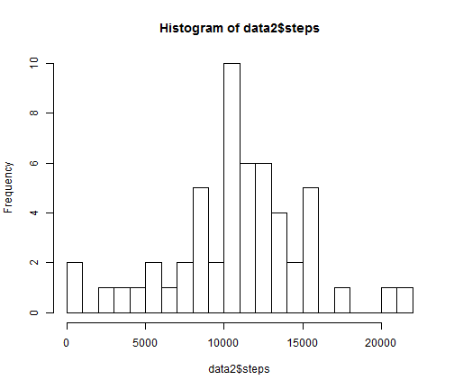
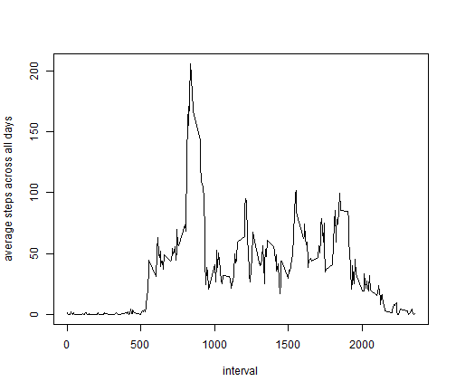
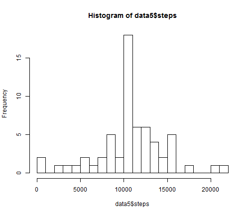

Reproducible Research - Peer Assessment 1
========================================================

Below you'll find the relevant code and explanations for the first assignment of the Reproducible Research data science class.

### Loading and preprocessing the data

The following loads necessary packages for answering the assignment questions

```r
library(knitr)
library(reshape2)
library(lattice)
```

Loads the assignment dataset 

```r
data <- read.csv("C:/Users/Alan/Desktop/RWD/activity.csv")
```

### What is the mean number of steps taken each day?

Create and transform new dataframe for plotting

```r
data2 <- melt(data, id = c("date", "interval"))
data2 <- dcast(data2, date ~ variable, fun.aggregate = sum)
```

Create histogram on transformed data

```r
hist(data2$steps, breaks = 20)
```

 

Calculate mean and median values of total steps by day

```r
mean(data2$steps, na.rm = TRUE)
```

```
## [1] 10766
```

```r
median(data2$steps, na.rm = TRUE)
```

```
## [1] 10765
```

### What is the average daily activity pattern?

Create and transform new dataframe for plotting

```r
data3 <- melt(data, id = c("date", "interval"))
data3 <- dcast(data3, interval ~ variable, fun.aggregate = mean, na.rm = TRUE)
```

Create time series plot on transformed data

```r
with(data3, plot(interval, steps, type = "l",
                 ylab = "average steps across all days", xlab = "interval"))
```

 

Order data to determine interval with max average step value (interval 835)

```r
data3 <- data3[order(data3$steps, decreasing = TRUE), ]
data3[1,]
```

```
##     interval steps
## 104      835 206.2
```

### Imputing missing values

Calculate total number of rows with NAs

```r
nrow(data[is.na(data$steps)==TRUE,])
```

```
## [1] 2304
```

Create new dataframe with NAs replaced with average steps per interval across days

```r
data4 <- data
for (i in c(1:nrow(data4))){
    if(is.na(data4$steps[i])){
        data4$steps[i] <- data3$steps[data3$interval==data4$interval[i]]
    }
}
```

Create and transform new dataframe based on newly imputed dataframe for plotting

```r
data5 <- melt(data4, id = c("date", "interval"))
data5 <- dcast(data5, date ~ variable, fun.aggregate = sum)
```

Create histogram on newly imputed dataframe

```r
hist(data5$steps, breaks = 20)
```

 

Calculate mean and median values of total steps by day.  These new values differ from results calculated from the non-imputed dataframe.  Imputing strategy has resulted in raising the median to match the mean.

```r
mean(data5$steps, na.rm = TRUE)
```

```
## [1] 10766
```

```r
median(data5$steps, na.rm = TRUE)
```

```
## [1] 10766
```

### Are there differences in activity patterns bewteen weekdays and weekends?

Create new dataframe with weekday/weekend factor variable

```r
data6 <- data4
for (i in c(1:nrow(data6))){
    if(weekdays(as.Date(data6$date[i])) %in% c("Saturday", "Sunday")){
        data6$w[i] <- "weekend"
    } else {
        data6$w[i] <- "weekday"
    }
}
```

Create and transform new dataframe with weekday/weekend factor

```r
data7 <- melt(data6, id = c("date", "interval", "w"))
data7 <- dcast(data7, interval + w ~ variable, fun.aggregate = mean, na.rm = TRUE)
```

Create panel plot by weekday type 

```r
xyplot(steps ~ interval | w, data7, type = "l", layout = c(1,2))
```

 
